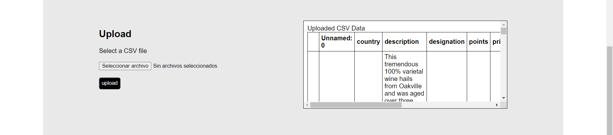
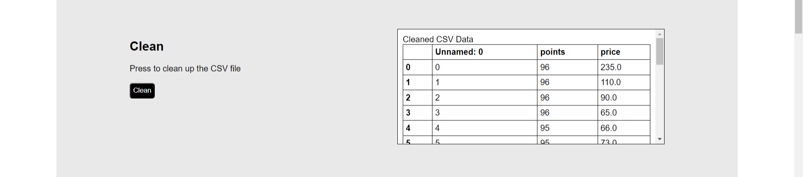
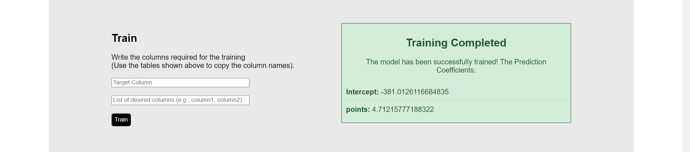
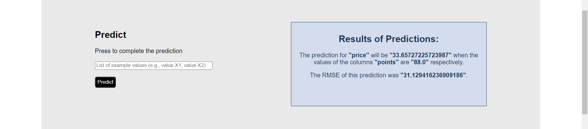

[](https://www.python.org/)
[](https://flask.palletsprojects.com/)
[](https://pandas.pydata.org/)
[](https://numpy.org/)
[](https://scikit-learn.org/)
[](https://developer.mozilla.org/en-US/docs/Web/Guide/HTML/HTML5)
[](https://developer.mozilla.org/en-US/docs/Web/CSS/CSS3)
[](https://www.docker.com/)

# Dockerized Multiple Liner Regression Web App

This project aims to create a simple Web App with the objective of letting the users make a prediction of their own data using a Multiple Linear Regression, this by first uploading their datasets or csv files, making a general cleaning of these, and then proceding to let the user choose what parameteres they want to use for the training of the MLR Model, and finally test it by writing the values desired to make the prediction. Also, all the project it's inside a Dockerized Enviroment.

## Index

- [Content Overview](#content-overview)
- [Installation](#installation)
- [Usage](#usage)
- [Guiding Steps](#guiding-steps)
- [Contributions](#contributions)
- [Credits](#credits)
- [License](#license)

## Content Overview

### 1. `app.py`

The Python code that serves the Web App by using `Flask`. It shows you the HTML Templates working, and the principal page or route is `index.html` that it serves the main process of the web app, and then it has another one called `about.html` that it's just a contact page for convention.

### 2. `core.py`

This Python script serves all the processes that `app.py` will do, these are `cleaner` that cleans the csv passed by the user, `trainer` that accomplish the process of training a model by using the cleaned csv created in the past process and the parameteres selected by the user, and then `predicter` that uses the model created and new values passed by the user to finally make the prediction and retrive it, all this using `pandas`, `numpy` and `sklearn`.

### 3. `templates/files`

This folder saves all the `.html` scripts that the Python codes will use for the web app. 

### 4. `static/css/files`

This folder saves all the `.css` scripts that makes the HTML templates look nice.

### 5. `uploads/`

Into this folder the csv's passed by the users are saved to make easier the access of these by the Web App.

### 6. `models/`

Into this folder the models created by the `core.py` are saved for make the predictions.

### 7. `mlrproject/`

Into this folder the Virtual Enviroment is saved, it is not needed to turn it on, it was created just for the development.

### 8. `requirements.txt`

Contains the required Python dependencies for the project, ensuring a consistent environment for the Dockerfiles to use.

### 9. `Dockerfile`

Configures the Docker image for the Web App by setting up the working directory, copying the necessary files, and installing dependencies. It specifies the command to run the Flask Python Script.

### 10. `docker-compose.yml`

Defines the Docker enviroment for the Docker image of the Web App, specifying the build context, and then it exposes port 5000 for accesing the Web App.

## Installation

1. Clone the repository:

    ```bash
    git clone -b master git@github.com:MDavidHernandezP/MultipleLinearRegressionWebApp.git
    cd "the proyect directory"
    ```
    
    OR:

    ```bash
    git clone https://github.com/MDavidHernandezP/MultipleLinearRegressionWebApp.git
    cd "the proyect directory"
    ```

2. Build and run the Docker containers:

    ```bash
    docker-compose up --build
    ```

## Usage

After succesfully have cloned the repository, and have built and run the docker compose file, you can access the Web App by going to your browser and accessing to your localhost into the port 5000 [http://localhost:5000](http://localhost:5000). Once you were there, that's it, you can use the Web App and make use of all its functions.

Also you can follow the section below for guidance if you're lost.

## Guiding Steps

First, you have to upload your csv or dataset, press the button to select the file from your file explorer, once the name of the file is beside that button, press the button `Upload` to actually do it, then the Web App should refresh and show you your csv.



Second, just scroll down to get to the clean section, here you just have to press the button `Clean` and the process will start automatically, when it finishes your cleaned csv will be shown. NOTE: The process of cleaning its kinda general so be careful with this because the cleaner might make or remove some things from your csv that might not be exactly correct.



Third, scroll down to get to the train section, into this section you'll have to write the exact target column for the prediction from your csv, and below write a column or an entire list of columns with the exact names, the trainer will use this or these for reference, once you've written the columns just hit the button `Train` and the training will begin, once completed the page will refresh and you could see the Prediction Coefficients.




Finally, scroll down to get to the predict section, there you'll have to write example values for the columns you selected in the past step, then hit the button `Predict`, the page will refresh again to make the prediction and show you the result with the values and columns you selected; also the page will show you the RMSE of the result value to see how correct the prediction was.



## Contributions

Any contribution is accepted for this project we align with the MIT License for open source. If you are interested in contributing directly with us or just copy our code for an own project, you're completly free to do it. You can contact us by this email in case of doubts or contributions: [mdavidhernandezp@gmail.com](mdavidhernandezp@gmail.com).

- **Steps for contributing:**
1. Fork the project.
2. Create a branch (`git checkout -b feature/new-feature`).
3. Commit your changes (`git commit -am 'adding new feature'`).
4. Push the branch (`git push origin feature/new-feature`).
5. Open a pull request.

## Credits

This project was originally created by a group team of Data Engineering Students for the subject Statistical Modeling.

1. MARIO DAVID HERNÁNDEZ PANTOJA
2. GERARDO HERNÁNDEZ WIDMAN
3. LUIS ARTURO MICHEL PÉREZ
4. OSCAR MARTÍNEZ ESTEVEZ
5. MOISÉS JESÚS CARRILLO ALONZO

Then it was reinvented for its improvement and is being mantained by:

1. MARIO DAVID HERNÁNDEZ PANTOJA

## License

This project is licensed under the MIT License

MIT License

Copyright (c) 2024 Mario David Hernández Pantoja

Permission is hereby granted, free of charge, to any person obtaining a copy
of this software and associated documentation files (the "Software"), to deal
in the Software without restriction, including without limitation the rights
to use, copy, modify, merge, publish, distribute, sublicense, and/or sell
copies of the Software, and to permit persons to whom the Software is
furnished to do so, subject to the following conditions:

The above copyright notice and this permission notice shall be included in all
copies or substantial portions of the Software.

THE SOFTWARE IS PROVIDED "AS IS", WITHOUT WARRANTY OF ANY KIND, EXPRESS OR
IMPLIED, INCLUDING BUT NOT LIMITED TO THE WARRANTIES OF MERCHANTABILITY,
FITNESS FOR A PARTICULAR PURPOSE AND NONINFRINGEMENT. IN NO EVENT SHALL THE
AUTHORS OR COPYRIGHT HOLDERS BE LIABLE FOR ANY CLAIM, DAMAGES OR OTHER
LIABILITY, WHETHER IN AN ACTION OF CONTRACT, TORT OR OTHERWISE, ARISING FROM,
OUT OF OR IN CONNECTION WITH THE SOFTWARE OR THE USE OR OTHER DEALINGS IN THE
SOFTWARE.

---